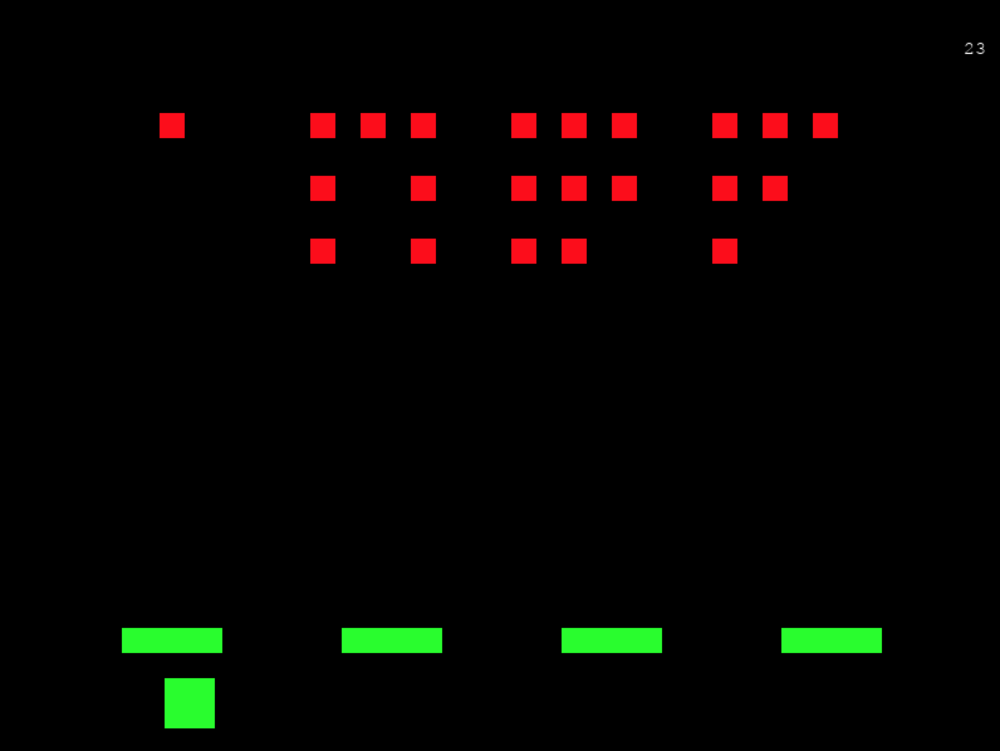

# Python Space Invaders
> Clone of Space Invaders written in Python using PyGame.



## Installation
```sh
git clone https://github.com/michaelmdresser/python-spaceinvaders
```

Requires PyGame `pip3 install pygame`

Run with python3 (eg `python3 invaders.py`)

## Meta

Distributed under the MIT license. See ``LICENSE`` for more information.

[https://github.com/michaelmdresser/python-spaceinvaders](https://github.com/michaelmdresser/)
